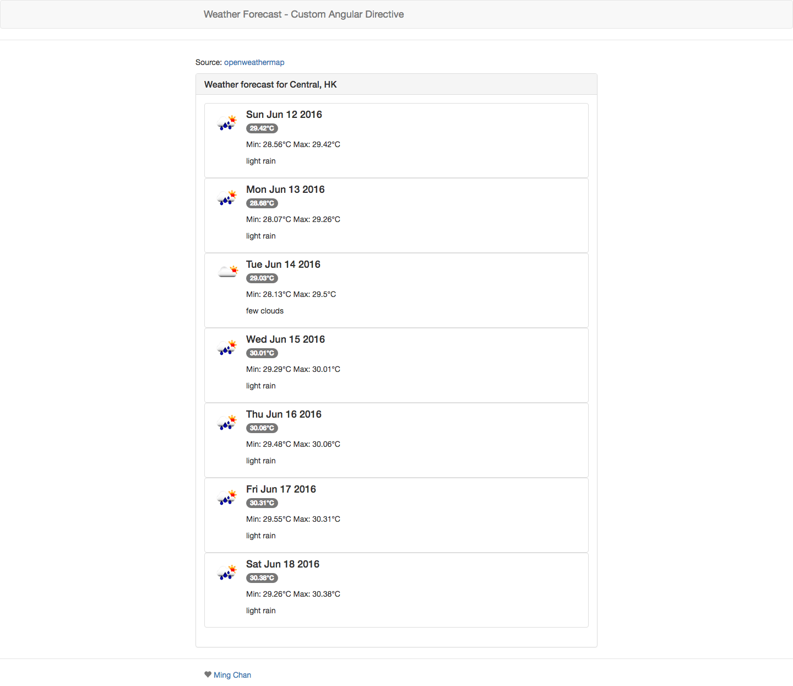

# Custom Angular Directive Example

This project is generated with [yo angular generator](https://github.com/yeoman/generator-angular)
version 0.15.1.

## Build & development

Run `npm install && bower install` 
Run `grunt` for building and `grunt serve` for preview.

## Open Weather API
For example to work, a [openweathermap API key](http://openweathermap.org/) is needed, after having API Key, go `app/scripts/app.js` and replace the comment with api key
```
.constant("openWeatherApiKey", /* <Your Open Weather API KEY goes Here> */)
``` 

## Usage
The example create a custom directive to receive forecast data from api.
`<div ng-sparkline ng-city="Central, HK"></div>`

## Code
```
.directive('ngSparkline', function() {
        return {
            templateUrl: 'views/forecast.html',
            restrict: 'A',
            require: '^ngCity',
            scope: {
                ngCity: '@'
            },
            link: function(scope, iElement, iAttrs, ctrl) {
                scope.getTemp(iAttrs.ngCity);
            },
            controller: ['$scope', '$http', 'openWeatherApiKey', function($scope, $http, openWeatherApiKey) {
                var url = "http://api.openweathermap.org/data/2.5/forecast/daily?&APPID=" + openWeatherApiKey + "&units=metric&cnt=7&q=";
                $scope.loading = true;
                $scope.getTemp = function(city) {
                    $http({
                        method: 'GET',
                        url: url + city
                    }).success(function(data) {
                        var weathers = [];
                        angular.forEach(data.list, function(value) {
                            weathers.push(value);
                        });
                        $scope.weathers = weathers;
                        // console.log(JSON.stringify(weather));
                    });
                };
            }],
        };
    })
```

```
    .directive('ngDailyItem', function() {
        return {
            templateUrl: 'views/forecast-daily-item.html',
            restrict: 'A',
            require: '^itemDetail',
            scope: {
                itemDetail: '@'
            },
            link: function(scope, iElement, iAttrs, ctrl) {
                scope.daily = JSON.parse(iAttrs['itemDetail']);
                scope.weather = scope.daily.weather[0];
                var newDate = new Date(scope.daily.dt * 1000);
                scope.date = newDate.toDateString();
            },
            controller: ['$scope', '$http', function($scope, $http) {}],
        };
    });
```

## Screencap
